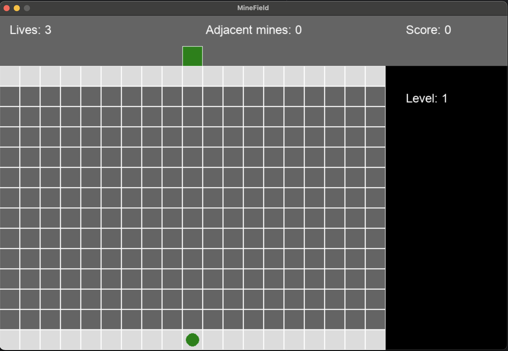

# MineField

A challenging puzzle game where you must navigate through a minefield to reach the exit!



## How to Play

### Objective
Guide the **green circle** (player) from the bottom safe zone to the **green exit door** at the top of the map while avoiding hidden mines.

### Controls
- **Arrow Keys**: Move the player
  - ↑ Up
  - ↓ Down
  - ← Left
  - → Right
- **ESC**: Quit the game
- **Y/N**: Continue or quit after hitting a mine

### Game Mechanics

#### The Player
- You start as a green circle at the bottom safe zone
- Navigate through the gray minefield to reach the top safe zone (exit)

#### Adjacent Mines Indicator
- The **"Adjacent mines"** counter at the top center shows how many mines are directly next to you (up, down, left, right)
- Use this information to carefully plan your moves and avoid mines

#### Scoring
- **+10 points** for each new cell you visit
- **+500 points** for reaching the exit and completing a level
- Try to maximize your score by exploring more cells safely!

#### Lives
- You start with **3 lives**
- Stepping on a mine costs you 1 life and reveals all mine locations
- When you lose all lives, the game ends

#### Levels
- Each time you reach the exit, you advance to the next level
- Higher levels have more mines, making the game progressively harder

### Safe Zones
- **Top row** (light gray): The exit zone - reach here to complete the level
- **Bottom row** (light gray): The starting zone - safe from mines
- **Middle rows** (dark gray): The minefield - contains hidden mines

### Tips
- Pay close attention to the Adjacent Mines indicator
- Plan your route carefully before moving
- Sometimes the safest path isn't the shortest one
- The game guarantees at least one safe path exists on every level

## Installation

### Requirements
- Python 3.x
- Pygame

### Setup
```bash
pip install pygame
```

### Run the Game
```bash
python main.py
```

## Game Over
When you run out of lives, you'll be asked if you want to continue:
- Press **Y** to restart with 3 lives and reset your score
- Press **N** to quit the game

Good luck navigating the minefield!

